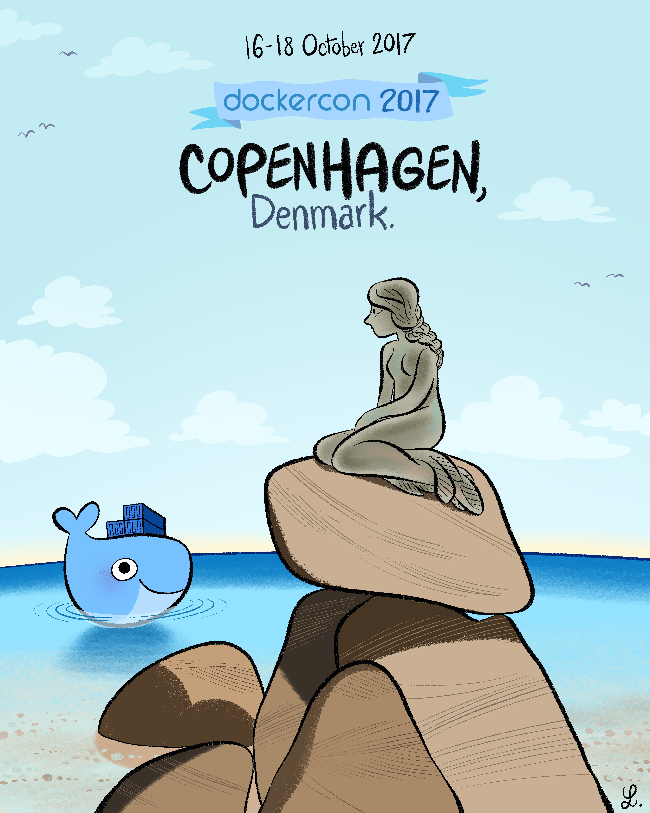

class: center, middle, inverse
## What's up ?


---
## Versions since last meetup

In december, Docker was in v *1.12.3*

We are currently in *v17.03.0-ce*
<p align="center">

</p>
---
## Docker daemon


* Add **--experimental**

* New prune command:

```bash
docker system prune {df,prune}

docker {container,image,volume,network} prune
```
* Allow engine to run inside a user namespace

* MAINTAINER is deprecated

---
## Swarm mode


Add secret managment:

```bash
echo "This is a secret" | docker secret create
    my_secret_data -

docker service  create --name="redis"
    --secret="my_secret_data" redis:alpine
```

---
## Docker CE and EE

Introducing Docker Community edition and Enterprise edition.

Community edition:

* Edge: every month
* Stable: quaterly

Enterprise edition:

* Basic: The Docker platform for certified infrastructure, with support from Docker Inc. and certified Containers and Plugins from Docker Store
* Standard: Adds advanced image and container management, LDAP/AD user integration, and role-based access control (Docker Datacenter)
* Advanced: Adds Docker Security Scanning and continuous vulnerability monitoring


---
## Docker lifecycle


---
## Save the date!

DockerCon will be back in [Europe in 2017](https://i0.wp.com/blog.docker.com/wp-content/uploads/DC-eu.jpg?resize=240%2C300&ssl=1)



---
class: center, middle, inverse

## 


